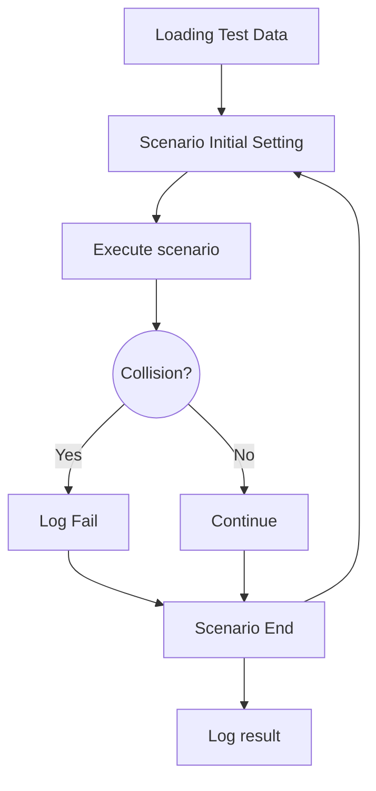

# av-testing

## Testing Configuration
### Scenario Setting
1. Initialize lgsvl.Simulator
1.1. Defines Host, Port
1.2. Setup Map, Weather, Time <--- Variables
2. Initialize EGO Vehicle
2.1. Create EGO agent - Model, Type, Postion
2.2. Configure EGO agent - Position <--- Variable
2.3. Bridge connection - Host, Port
3. Initialize Dreamview (AV Stack)
3.1. Connect Simulator, EGO, and Bridge
3.2. Setup Map, Car
3.3. Configure Destination vector <--- Variable
3.4. Configure modules - Localization, Transform, Routing, Prediction, Planning
4. Configure other objects <--- Variables
4.1. NPC - Car, Pedestrian, Cone, etc.
4.1.1. Waypoints or Random
4.2. Traffic Lights

### Execute Scenario
1. Simulator run in a while True loop
2. Constantly logging EGO status - Speed, Distance to Object, Destination reached, collision
3. Stop when Destination reached
4. Fail when collision or too close to target object
4.1. log speed, postion of both ego and npc

### Validation
1. Did car stop?
2. Destination reached?
3. etc.

### Automation Flow
Required chrome extension: [link](https://chrome.google.com/webstore/detail/github-%2B-mermaid/goiiopgdnkogdbjmncgedmgpoajilohe/related?hl=en)
