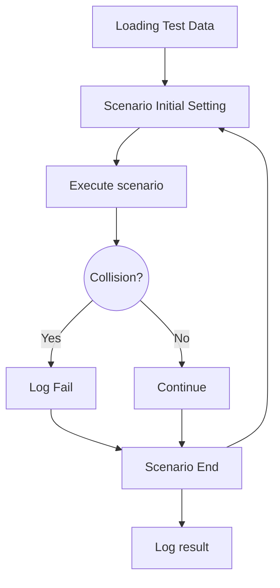

# av-testing

### Automation Flow
Required chrome extension: [link](https://chrome.google.com/webstore/detail/github-%2B-mermaid/goiiopgdnkogdbjmncgedmgpoajilohe/related?hl=en)

```mermaid
graph TD
A[Loading Test Data] --> B
B[Scenario Initial Setting] --> C
C[Execute scenario] --> D
D((Collision?)) -- Yes --> E
D -- No --> F
E[Log Fail] --> G 
F[Continue] --> G
G[Scenario End] --> H
G --> B
H[Log result]
```