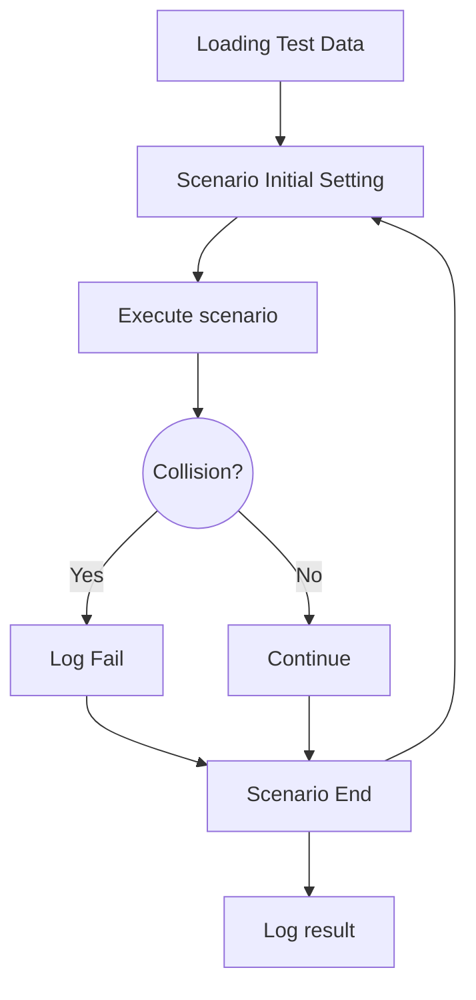

# av-testing
This is class project for SJSU 2021 Spring CMPE 187/287.  

## Testing Configuration
### Scenario Setting
1. Initialize lgsvl.Simulator  
1.1. Defines Host, Port  
1.2. Setup Map, Weather, Time <--- Variables  
2. Initialize EGO Vehicle  
2.1. Create EGO agent - Model, Type, Postion  
2.2. Configure EGO agent - Position <--- Variable  
2.3. Bridge connection - Host, Port  
3. Initialize Dreamview (AV Stack)  
3.1. Connect Simulator, EGO, and Bridge  
3.2. Setup Map, Car  
3.3. Configure Destination vector <--- Variable  
3.4. Configure modules - Localization, Transform, Routing, Prediction, Planning  
4. Configure other objects <--- Variables  
4.1. NPC - Car, Pedestrian, Cone, etc.  
4.1.1. Waypoints or Random  
4.2. Traffic Lights  

### Execute Scenario
1. Simulator run in a while True loop  
2. Constantly logging EGO status - Speed, Distance to Object, Destination reached, collision  
3. Stop when Destination reached  
4. Fail when collision or too close to target object  
4.1. log speed, postion of both ego and npc  

### Validation
1. Did car stop?  
2. Destination reached?  
3. etc.  


## Automation Flow
Required chrome extension: [link](https://chrome.google.com/webstore/detail/github-%2B-mermaid/goiiopgdnkogdbjmncgedmgpoajilohe/related?hl=en)


## File Structure
```
├── data
│   ├── asset                       # Wrapper class for svl simulator models
│   ├── pretestdata                 # school bug example of data for test case generation
│   └── testdata                    # generated test case data for automation
├── example                         # Some example code or test script
├── lib
│   ├── simulation.py               # Core for simulation code, integrated Python API and Dreamview API
│   └── utils.py                    # Helper functions for vector calculation
├── requirements.txt                # Python modules list
├── automation.py                   # CLI for test data generator, automation runner, and stress test runner
├── results                         # Test results
│   ├── 02_stop_sign
│   ├── 03_parking
│   └── 04_school_bus
├── testcases                       # Test case script example
│   ├── parking.py
│   ├── right_turn.py
│   ├── school_bus.py
│   └── stop_sign.py
└── tool # useful tools
    ├── location.py                 # get location vector of EGO car, replaced by Visual Editor
    └── test_case_generator.py      # test case generateion script
```


## Environment Setup

### Requirement
#### Hardware
Nvidia 1080 or better  
2 Systems: Windows(Simulator) + Ubuntu 20(Apollo)  
1 System: Ubuntu(Simulator + Apollo)
#### Software
- [Python](https://www.python.org/) - Should have Python3.x in ubuntu by default
- [SVL simulator](https://www.svlsimulator.com/) - Unity Based simulator
- [ApolloAuto](https://github.com/ApolloAuto/apollo) - AD stack for self driving car
- [SVL simulator Python API](https://www.svlsimulator.com/docs/python-api/python-api/) - SVL simulator Python API, support simulator and dreamview
- [Robot Framework](https://robotframework.org/) - Framework for test suite development
- [matplotlib](https://matplotlib.org/) - Data visualization library for Python

### Installation
1. Download from: https://www.svlsimulator.com/
2. Install Apollo following: https://www.svlsimulator.com/docs/system-under-test/apollo-master-instructions/
3. Install PythonAPI following: https://www.svlsimulator.com/docs/python-api/python-api/
4. Install required libraries: `pip3 install -r requirements.txt`

### Test case generation
This step highly depends on AI Testing Tool, required modeling tree to be built in specific syntax.  
Context must named with prefix 'c_'  
Input must named with prefix 'i_'  
The generator will parse exported csv file from AI Testing Tool. Then subtitue string into user defined template(component.py).  

For template, we can get a base template by creating the simulation setting with Visual Editor provided by SVL simulator. 
Then add following data into the json file.
```
{
    "testcase": { # test case information
        "name": "testcasename",
        "id": "testcaseid",
        "reportpath": "testreportpath",
        "context": "contextinfo",
        "input": "inputinfo"
    },
    "agents": [ # EGO car modules
        {
            "modules": ["Localization","Transform","Routing","Prediction","Planning","Control"],
        }
    ],
    "time": "c_time", # time setting
    "weather": "c_weather", # Weather setting
    "simulation_time": 10  # Simulation stop after 
}
```

Syntax: `Syntax: python3 test_case_generator.py <test data path> <output path>`  
Sample:  `python3 tool/test_case_generator.py data/pretestdata/school_bus data/testdata/04_school_bus/`

### Execute Test Case

Predefined test case script
`python3 testcases/school_bus.py`

Run with automation.py
```
usage: AV-Testing Automation [-h] [--testcasegen] [--pretestdata PRETESTDATA]
                             [--testcasedata TESTCASEDATA] [--automation]
                             [--reportpath REPORTPATH] [--stress STRESS] [-d]

optional arguments:
  -h, --help            show this help message and exit
  --testcasegen         Test Case Generator
  --pretestdata PRETESTDATA
                        Pretest data path
  --testcasedata TESTCASEDATA
                        Test Case file output path
  --automation          Run Automation
  --reportpath REPORTPATH
                        Test Case file output path
  --stress STRESS       Stress test cycle number
  -d, --debug           Debug mode
```
#### Test case generation
This will use predefined configuration under 04_school_bus to generate test data in simple_run directory.  
`python3 automation.py --testcasegen --testcasedata ./data/testdata/simple_run/ --pretestdata ./data/pretestdata/04_school_bus/`

#### Automation Test sample
This will run all detected scenarios within the given directory and store reports into result2.  
`python3 automation.py --automation --testcasedata ./data/testdata/simple_run/ --reportpath ./result2`

#### Stress Test sample
This will run test scenario AV-3.001 5 tims and store report into result3.  
`python3 automation.py --stress 5 --testcasedata ./data/testdata/simple_run/03_parking_lot/AV-3.001.json --reportpath ./result3`

